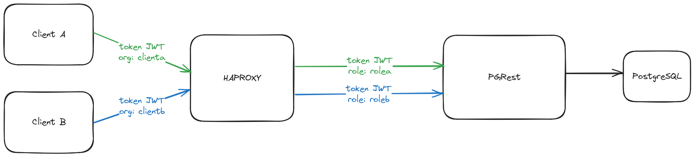

# Mock data tooling

Ce chart helm permet d'exposer une base de données postgresql via une API REST.

## Composants



- haproxy: agit en tant qu'API Gateway
- postgrest: expose la base de données postgres au protocol REST
- cloudpgnative: opérateur k8s pour gérer un cluster de postgresql
- pgadmin: administration de la base de données
- vector: gestion des logs
- sops: gestion des secrets

### Utilisation depuis argocd

Pour utiliser cette application depuis argocd, il est nécessaire de specifier les paramètres suivants:

- dossier à utiliser: helm/
- fichiers values:
  - un fichier values selon l'environnement et la phase de développement (exemple: values-ovh-dev.yaml, values-mi-dev.yaml)
  - un fichier values selon l'état du cluster CNPG, soit primary (values-cnpg-primary.yaml), soit replica (values-cnpg-replica.yaml)
  - optionnel: fichier values pour avoir une base de données pour la reprise des anciennes données (values-cnpg-old-data.yaml)
  - optionnel: mettre la clé dataloader.enabled à true pour avoir accès à un script de chargement de données.

>[!WARNING]
> Un changement de primary/replica n'est pas une opération facile
> En plus de changer les fichiers values dans argocd, il faudra aussi faire le ménage sur le stockage S3 et enlever le dossier `wals` afin que le nouveau primaire puisse écrire (erreur visible dans les logs du cluster CNPG)

### Api Gateway

HAProxy fait office d'API Gateway en authentifiant les clients via un token JWT (voir section après pour la génération du token).
Ce token doit contenir la clé **org**, qui sera le nom du client.

Chaque client aura sa propre section backend, exemple avec 2 clients nommés clientA et clientB:

```ini
backend clientA
  http-request set-header Authorization "Bearer ...roleA..."
  server pgrestservice pgrest:3000

backend clientB
  http-request set-header Authorization "Bearer ...roleB..."
  server pgrestservice pgrest:3000
```

Bien que renvoyant vers le même serveur pgrest, le découpage permet de mettre en place différente stratégie selon le client (rate-limiting, role particulier à utiliser via pgrest, rejet, ...). Cela permet aussi, via les métriques exposées par haproxy, d'avoir le nombre de connexion pour chaque client.

### PGRest

PostgREST permet d'exposer une base de données PostgreSQL sous forme d'API REST.

PGRest permet d'utiliser plusieurs profils via token JWT, qui devra contenir la clé **role**:

```json
{
    "role": "rolea"
}
```

Quand pgrest reçoit un token jwt en header de la requête, sa 1ère action après la connexion à la bdd, sera de faire la requête suivante (exemple pour le role nommé rolea):

```sql
SET ROLE "rolea"
```

Si aucun token n'est soumis dans les headers, le role choisi par PGRest sera le role par défaut **anon** (ce rôle doit exister au niveau de la base de données).

Pour configurer pgrest, il est possible de passer par la configmap pgrest-config, ainsi que par le secret du même nom.
Ces 2 objets seront montés en tant que variables d'environnement.

#### Token JWT

Point d'attention sur les tokens JWT.

Il y aura besoin d'au moins 2 tokens JWT:

- un entre le client et haproxy (nommé token haproxy dans le bloc après)
- un entre haproxy et pgrest (nommé token pgrest dans le bloc après)

Quand haproxy reçoit et valide le token haproxy (contenant la clé `org`), il dispatche la requête selon sa configuration dans un backend particulier.

Ce token est ensuite réécrit (header `Authorization: Bearer ...`) pour substituer le token pgrest (contenant la clé `role`) au token haproxy.

De ce fait, PGRest n'a pas idée du token entre le client et haproxy et le client n'a pas en sa possession le token permettant de parler directement à PGRest.

### CNPG

CloudPGNative est utilisé pour gérer le cluster de postgresql.

Cet opérateur permet de spécifier le nombre d'instance, les roles à créer, ainsi que la gestion automatique des backups et du recover.

#### Reprise de données

Le fichier `values-cnpg-old-data.yaml` permet de mettre en place un 2ème cluster cnpg afin d'avoir une base de données pour la reprise de données.

#### Chargement des données

Un script `conf/dataloader/dataloader.sh` permet de télécharger un fichier SQL depuis un S3 et le charger en base.

Un cronjob avec une date d'exécution impossible (31/02) permet de lancer ce script via argocd (cliquer sur les 3 points à côté du cronjob) ou via la commande suivante:

```bash
oc create job dataloader --from cj/dataloader
```

Ce script est mis en dur dans l'image dataloader, construire via le Dockerfile présent dans ce dépôt (pipeline gitlab à exécuter au moins une fois avant de pouvoir s'en servir).

### Sops

Ce chart fait appel à l'utilitaire SOPS pour chiffrer les secrets et pouvoir les versionner sur git (à installer en pré-requis).

Les secrets doivent être placés dans le dossier `conf/secret/<environnement>/<phase>/` et le nom finir par l'extension `.dec` .

L'utilitaire `encrypt.sh` permet de chiffrer les fichiers présent dans le dossier et s'utilise comme suit:

```bash
bash encrypt.sh <environnement> <phase>
```

Tous les fichiers avec l'extension `.dec` seront automatiquement chiffrés et enregistrés avec l'extension `.enc`.

> [!NOTE]
> Les fichiers avec l'extension `.dec` sont ignorés pour git

#### Clé AGE

Pour l'instant, les clés publiques AGE correspondant à ovh, mi hors prod mutuel et mi prod mutuel sont dans le fichier `encrypt.sh`

Pour en ajouter d'autres (ou d'autres phase sur ovh/mi), il faut modifier le script et ajouter des éléments au tableau associatif suivant (exemple avec le code existant):

```bash
AGE_KEY_OVH_DEV=age1g867s7tcftkgkdraz3ezs8xk5c39x6l4thhekhp9s63qxz0m7cgs5kan9a
AGE_KEY_MI_INTEG=age1lxduvqtglrdj38m27gsa4akdu82keqwgh7r57ep3dcwf7uaref4qtafwy5
AGE_KEY_MI_PROD=age190waxlxyv9l0s5ec8600u7ujknrugffz6fjxde8tndy9gw68rckstws8dp

encrypt_path="$1/$2"

# Correspondance <environnement> <phase> avec la clé publique AGE
declare -A keys=[]
keys["ovh:dev"]=${AGE_KEY_OVH_DEV}
keys["mi:integ"]=${AGE_KEY_MI_INTEG}
keys["mi:prod"]=${AGE_KEY_MI_PROD}
```

Chaque élément est composé d'une clé sous la forme `<environnement>:<phase>` et de sa clé publique AGE associée.

Si jamais vous avez besoin d'une clé particulière (pour les cluster dédié notamment), demander à la Service Team.

### Swagger

PGRest génère une configuration OpenAPI disponible via le swagger intégré dans ce chart.

## A faire avant d'utiliser ce chart

Il faut se poser la question des rôles à créer au niveau de la base de données (minimum 3: le rôle anon et un rôle autorisé à faire les opérations nécessaires, ainsi qu'un rôle qui aura le droit de login - aka un utilisateur).

## Misc

### Ajouter un environnement

- créer le fichier values correspondant à l'environnement, en définissant les variables **environment** et **phase**. Ces variables serviront pour retrouver des fichiers via une arborescence particulière.
- créer une clé asymétrique, stocker la partie privée dans un lieu sécurisé, la partie publique ira dans le dossier `conf/haproxy/<env>/<phase>/public.pem
- créer les tokens JWT pour les différents clients
- créer les différents secrets dans conf/secret/<env>/<phase>
- créer les tokens JWT pour la connexion entre haproxy et pgrest

### Génération token JWT

Utiliser le site [jwt.io](https://jwt.io/) pour générer les tokens jwt.
Concernant l'algorithme à choisir dans la liste déroulante:
- **HS256** en cas d'algorithme à clé symétrique (par exemple entre haproxy et pgrest)
- **RS256** en cas d'algorithme à clé asymétrique (par exemple entre les clients et haproxy)

Le champ payload contiendra les données contenues dans le token JWT.
Pour haproxy, les données devront contenir la clé **org**, exemple pour le client A:
```json
{
    "org": "clienta"
}
```

Un autre exemple entre haproxy et pgrest utilisant le role A:
```json
{
    "role": "rolea"
}
```

### Génération d'un certificat

```bash
openssl genrsa -out key.pem 2048
openssl rsa -in key.pem -outform PEM -pubout -out public.pem
```

Le fichier `public.pem` est à mettre dans le dossier `helm/conf/haproxy/<env>/<phase>/`

### S3

Il existe un chart helm trouvable [ici](https://github.com/cloud-pi-native/mock-data-tooling-minio) pour simuler un S3 avec minio.


